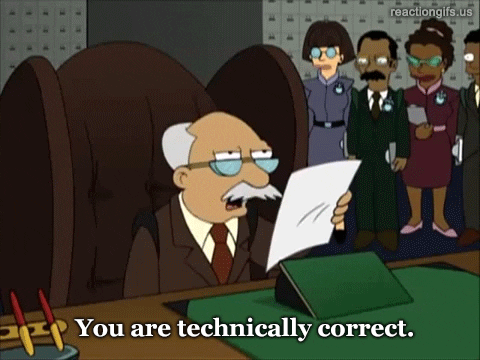

As most interesting quests start, I was reading the chat on the [creatures.dev](https://creatures.dev) Discord server and people where talking about site maps.

The problem arose from a comment that removing trailing slashes (e.g.: the last `/` in `https://example.com/`) caused the astro plugin for generating site maps to fail.

## Down the rabbit hole

I asked myself: "why do we need the trailing slashes?" and then "does it make any difference?"

A couple search results later, I found out my answer: _it depends_.

To answer the question we need to talk URLs, semantics, servers, and people. Let's start with the first two...

## URLs

Here is the definition of URLs, according to [Wikipedia](https://en.wikipedia.org/wiki/URL):

> A **Uniform Resource Locator** (**URL**), colloquially known as an **address** on the [Web](https://en.wikipedia.org/wiki/World_Wide_Web "World Wide Web") is a reference to a [resource](https://en.wikipedia.org/wiki/Web_resource "Web resource") that specifies its location on a [computer network](https://en.wikipedia.org/wiki/Computer_network "Computer network") and a mechanism for retrieving it. A URL is a specific type of [Uniform Resource Identifier](https://en.wikipedia.org/wiki/Uniform_Resource_Identifier "Uniform Resource Identifier") (URI), although many people use the two terms interchangeably. URLs occur most commonly to reference [web pages](https://en.wikipedia.org/wiki/Web_page "Web page") ([HTTP](https://en.wikipedia.org/wiki/Hypertext_Transfer_Protocol "Hypertext Transfer Protocol")/[HTTPS](https://en.wikipedia.org/wiki/HTTPS "HTTPS")) but are also used for file transfer ([FTP](https://en.wikipedia.org/wiki/File_Transfer_Protocol "File Transfer Protocol")), email ([mailto](https://en.wikipedia.org/wiki/Mailto "Mailto")), database access ([JDBC](https://en.wikipedia.org/wiki/Java_Database_Connectivity "Java Database Connectivity")), and many other applications.

Now that makes a little bit of sense: an URL is an _"address"_, the means to _find_ something.

## Semantics and technicality



When URLs were created they would map a file system hierarchy on a computer. That means that any path was made to resemble folders and files.

If you are navigating a file system structure in a terminal usually everything ending in a `/` will mean a _directory_ or _folder_, where things that **do not** are _files_.

That distinction caries over to URLs as well. So, _technically_, anything without a trailing slash is a file.

## That is cheating!

When we load a page, like this blog post, it is inside an internal path like this:

```
https://madcampos.dev/blog/2024/01/trailing-slashes-and-you
```

That means that in the server's file system it would be inside this sequence of folders:

- `/blog/`
  - `/2024/`
    - `/1/`

And it means the post itself, the `trailing-slashes-and-you` part, is an actual _file_. But in reality it **is not**. I'm cheating a little bit here as this is actually a folder with an `index.html` file inside it. See for yourself: [https://madcampos.dev/blog/2024/01/trailing-slashes-and-you/index.html](/blog/2024/01/trailing-slashes-and-you/index.html)

## Directory indexing

Servers do a really cleaver trick when you load a URL ending in a trailing slash. They look for an `index.html` inside that folder[^1].

That index file originally would be a list of all files on the folder and people would be able to read the contents of the folder. Here is an example of a website that _does_ that, the Firefox releases archive: https://ftp.mozilla.org/pub/firefox/releases/

But we can't have nice things and we started abusing it.

## People are strange

An URL ending in a `.html` extension look weird, it looks even weirder if you see something like `.php`, `.aspx`, or `.cfc` . It looks sketchy and unwelcoming.

We started doing a clever trick to get a "bare" URL (without an extension) that looks "nicer". We started creating folders and adding an `index.html` there with the content we want, instead of creating multiple `child.html` files.

And that is where we ended up on the debate about having trailing slashes or not. The slashes at the end became meaningless. Sorta.

## Preferences and SEO

Nowadays search engines will not care and will index your pages whatever they contain slashes or not. The problem is again, a page with a trailing slash is _technically different_ than a page without one.

To solve the technicality, you have to specify a [canonical URL](https://en.wikipedia.org/wiki/Canonical_link_element) for your page and SEO will treat both as the same thing.

Nowadays it doesn't really matter, but one rule of thumb is to be consistent on what you chose and stick with it.

As a closing note, if you are looking for more thorough insights trailing slashes, this is the post I used as reference, give it a read: https://www.zachleat.com/web/trailing-slash/

[^1]: There is more to it and technically an URL does not have to map one-to-one to a file on someone else's computer. But for the sake of this post, let's pretend it does.
