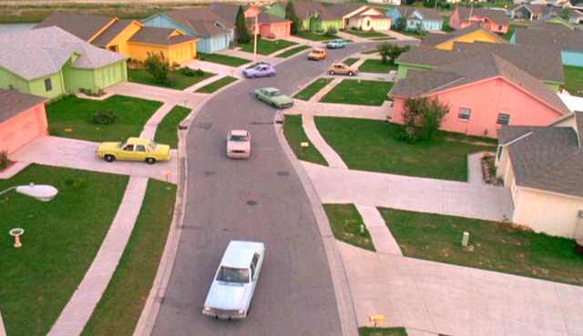
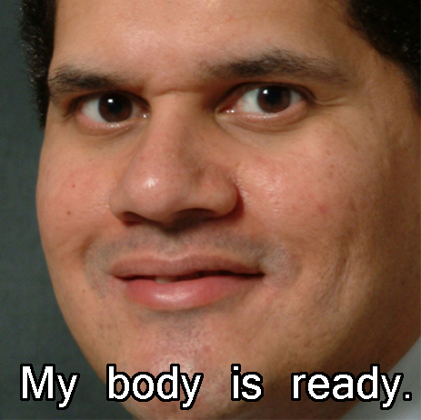
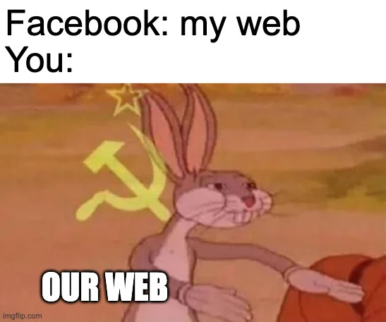

I'm seeing some recent changes on the web. People seem to be getting bored by social media, I mean, they _are_ addictive and when you see it, you've been mindlessly scrolling some algorithmic for 2 hours.

## AI, algorithms and world dominance

It is interesting to look how the "AI revolution" took everything by storm and is changing how we consume and produce the web. As almost everything in our lives nowadays is digital, that means it has a tangible impact in our day to day and even on molding behaviours outside of the digital space.

I cannot go anywhere without my phone those days. There are moments where I stare at the screen hoping for _something_ to happen. That is peak digital life! 👍

This bleak reality makes me wish for the return of time based _timelines_ (it is in the name of the darn thing for fracking sake!)

It is funny how every app seems to require an algorithmically generated timeline of something, an AI chat bot and dark mode. I take the dark mode, please remove the rest or at least give me _options_ and _some control_.

## #NaturalBeauty

I feel we are in a weird turning point, like that seconds before a 90 degree drop of a rollercoaster where you contemplate your life. You can't go back but it is too scary to go further.

The same thing seems to be happening to the web, we are still stuck to _silos_. Those are the walled gardens, the platforms where everything is nice, people are always smiling and looking their best. Every facade is meticulously manicured to be the most perfect version of itself.

Yet there seems to also be a feeling of tiredness of all this. A unquenchable thirst for "authentic" and "real" things. So...

## Let's make revolution™!

I present to you, dear reader, a concept that I myself found recently but it seems to be the solution that I've been looking for (also because I like to thinker).

This solution is: the [IndieWeb](https://indieweb.org/)!

You may ask:

<figure>
  <blockquote>
    
What is this amazing innovation that left me gasping for air?

  </blockquote>
  <figcaption>
    <cite>You, just now</cite>
  </figcaption>
</figure>

To which I reply: gasp not, dear reader, I shall explain now...

## What is this IndieWeb thing?

It is a way to retake the ownership of our data, let it be ours again and not confined to silos. It puts you in the spotlight of your data, let's you publish, edit, change, and do whatever you want with it outside of the walls of the cesspools that are social media.

If you want, you can repost your data to those silos, and consume updates from them as well.

Unfortunately right now it seems a little bit contrived to put everything together, but with a little bit of love you can put everything together, for almost free!

I'll be following up on this subject with a post on [webmentions](https://indieweb.org/Webmention), once I get that working properly. You can also read for now on the [basics of metadata](/blog/2024/02/metadata-for-the-masses).

Until then let's retake the web from FAANG's fangs!

