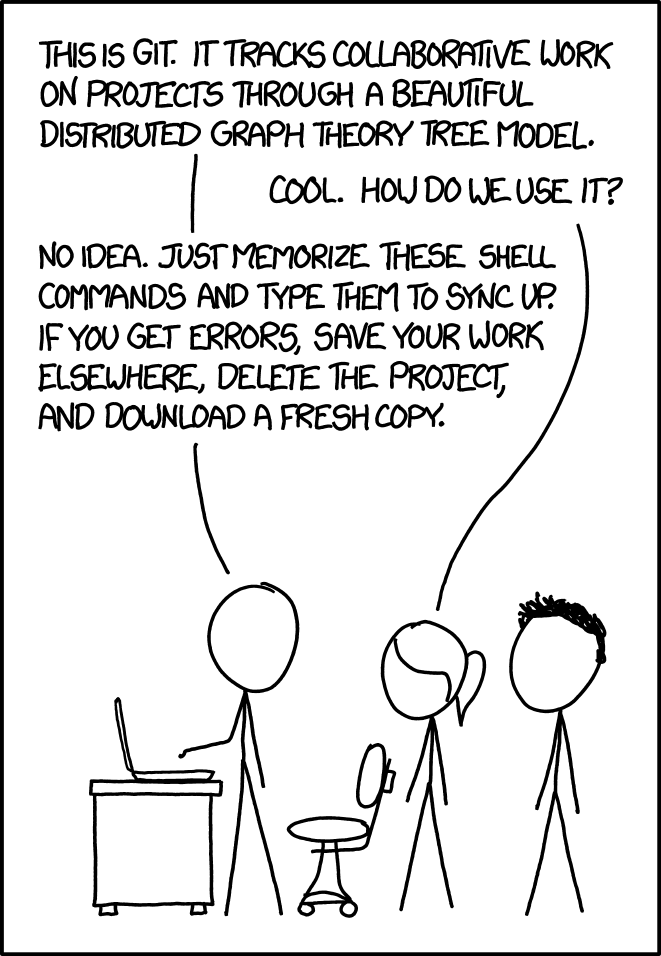

Node has a module problem, a large, [neutron star](https://en.wikipedia.org/wiki/Neutron_star) sized one and we all know it...

\[cue joke about node modules size.\]

It has another problem: projects and the module resolution algorithm.

The other day [this article](https://borischerny.com/javascript,/typescript/2024/06/19/ES-Modules-Are-A-Mess.html) ended up my way and it is very true and infuriating how hard it is to deal with the CommonJS vs ESM problem. While ESM does indeed provide a way to make module resolution and referencing files all around easier and predictable, we still have to deal with a lot of CommonJS modules, specially if you bundle your code, but that is not all.

Don't think using other tools like pnpm or yarn doesn't make the things much better either. Truth is: the module resolution algorithm in node is arcane, quirky and has to be purged and we should all move to ESM. Rip the band-aid, break things like Python 2 and Python 3! Chaos!

The cherry on top of module resolution and the pile of complexity that is modern day development is this magic idea called ✨ monorepo ✨! Someone thought it would be a good idea to have all the code for different projects and packages in a single git repository. It is an interesting concept, but requires specialized and very complex tooling.

As a semi-aside: I think it is a hard problem without an easy solution. I've worked on monorepos before and on projects with multiple repositories, all work in the end and are a confusing mess regardless. We are all doomed to maintain legacy code anyways... 🤷‍♂️

## What happened sweetheart?

My pain began with how hard it is to build monorepos! On Windows! On my specific setup[^1]

My problem is _**specifically**_ with the state of node, the heinous crime against humanity it calls module resolution and all of the tooling built around it. If you have anything a little bit more complex than a project with a _very_ flat dependency list. It is akin to purgatory.

The other day I was trying to contribute to an open source project because I love using it but there was a tiny missing feature, so I said to myself: _okay, what can possibly go wrong?_

## Famous last words

First time the project build no problem, but on the other day when I got back to finish the work then disaster ensued... It was so hard to re-build the project! I got errors on top of errors for modules not being found... _ALL THE TIME!_

Deleted node modules... Error!

Deleted pnpm cache... Error!

Tried using WSL... Error!

Tried using Dev Containers... Error!

The only viable solution was to recursively delete all the `node_modules` folders from all the packages on the monorepo, install everything again, then build the whole fricking project. For every change made.

Save the file? Do everything again... Debugging was painful that day...

Luckily, I'm on a fast machine and it _only_ takes about 7 minutes to do this whole ordeal...
Here is the breakdown:

- 1:30 minute to delete all `node_modules` folders
- 1 minute to install all modules (cached)
- 4 minutes to build the project

That is a massive headache and still gave me an error!

## Have you tried turning it off and on again?

In the end I resorted to the classic [solution proposed by XKCD](https://xkcd.com/1597/) how to deal with ~~git~~ node modules:

Transcript of the comic:

> \[Cueball points to a computer on a desk while Ponytail and Hairy are standing further away behind an office chair.\]
>
> Cueball: This is git. It tracks collaborative work on projects through a beautiful distributed graph theory tree model.
>
> Ponytail: Cool. How do we use it?
>
> Cueball: No idea. Just memorize these shell commands and type them to sync up. If you get errors, save your work elsewhere, delete the project, and download a fresh copy.

## The End?

So yeah, I deleted everything and started from scratch, it worked, but one thing still lingers in my mind: WHY IS IT SO HARD?!

Okay, #rant over, back to the regular _programing_ (pun intended)...

[^1]: My particular setup is not so weird, it is Windows 11, with the latest LTS version of node, I'm using PowerShell as my shell. The only interesting thing is my projects are all in a different drive than the default `C:` drive.
