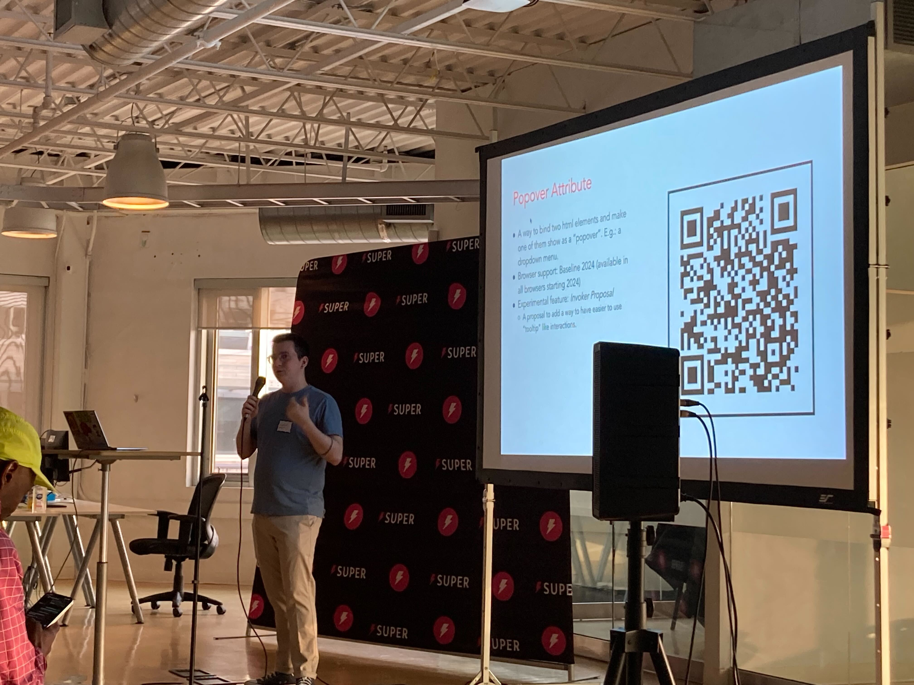

A quick summary of 5 features on the web platform that may be lesser known. The features described are recent but fairly well supported in modern browsers.

Along with a quick description and browser support for each feature, there is a QR code for an example and another related feature that is not so well supported or still a proposal.

The features on the talk are:

- Web Share API
- Payment Request API
- Popover Attribute
- Web Authentication API
- Declarative Shadow DOM

## Web Share API

The Web Share API makes sharing available to a web app. With it, users are able to invoke the browser native sharing capabilities and don't need to resort to recreating the same sharing mechanisms all over.

By integrating with the operating system, it allows for sharing outside the app to other apps.

You can check a demo here: https://w3c.github.io/web-share/demos/share.html

## Payment Request API

The Payment Request API provides a way to ask for payment information from users like credit card in a secure way. It allows access to the user's saved payment information on your Google, Apple or Microsoft account.

You can check a demo for it here: https://googlechrome.github.io/samples/paymentrequest/

## Popover Attribute

This HTML attribute adds the ability to create interactions like dropdown menus without the use of javascript.

You can check a demo here: https://mdn.github.io/dom-examples/popover-api/

## Web Authentication API

This API allows for easier authentication of users, with the browser providing fully managed credentials.

This also allows for newer interactions like [passkeys](https://www.future.1password.com/passkeys/).

You can find a demo here: https://www.passkeys.io/

## Declarative Shadow DOM

Web components allow developers to create rich interactions using native browser technologies instead of frameworks. With Declarative Shadow DOM it goes a step further by allowing web components to be created declaratively, solving problems like server side rendering.

You can find an article about it here: https://developer.chrome.com/docs/css-ui/declarative-shadow-dom

## What Else?

The web platform is ever evolving, so it is good to check every so ofter what proposals are out there. Here is a list of links where those proposals happen:

- Interop every year – [https://wpt.fyi/interop-2024](https://wpt.fyi/interop-2024)
- Web Incubator Community Group – [https://github.com/WICG](https://github.com/WICG)
- W3C – [https://github.com/w3c/](https://github.com/w3c/)
- TC39 Proposals – [https://github.com/tc39/proposals](https://github.com/tc39/proposals)
- Open UI – [https://open-ui.org/](https://open-ui.org/)
- What PWA Can Do Today? – [https://whatpwacando.today/](https://whatpwacando.today/)
- What Web Can Do Today? – [https://whatwebcando.today/](https://whatwebcando.today/)
